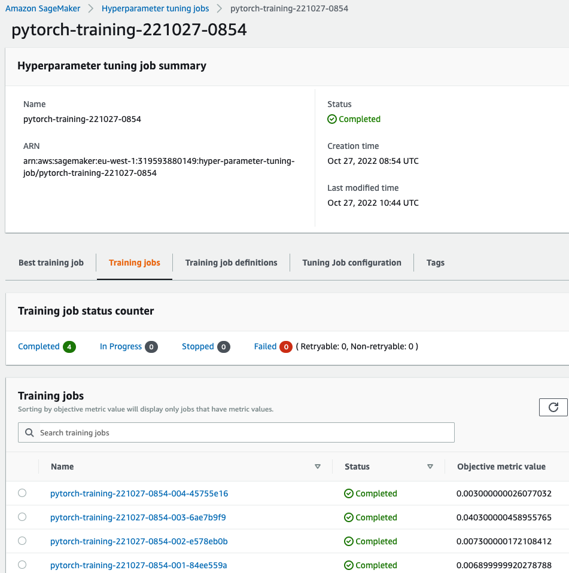
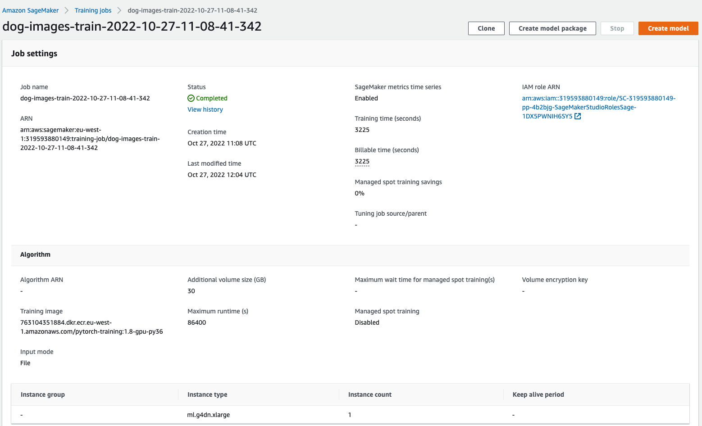
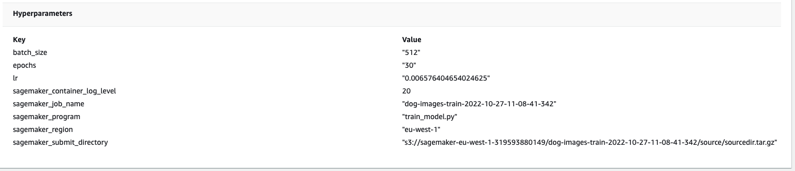
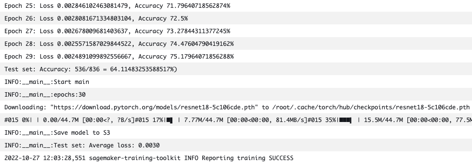
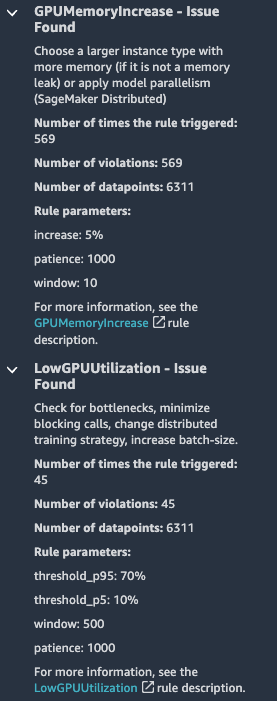
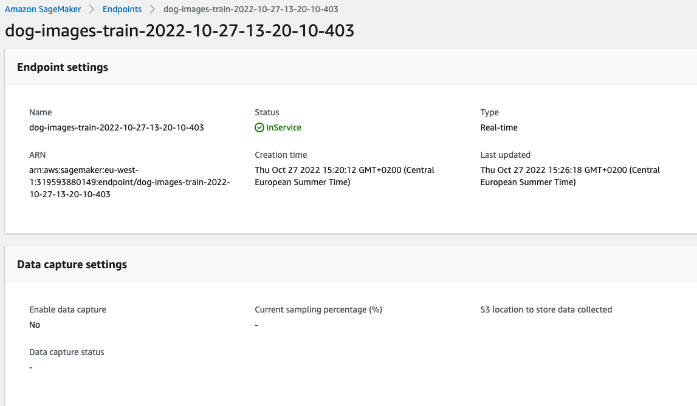

# Image Classification using AWS SageMaker

Use AWS Sagemaker to train a pretrained model that can perform image classification by using the Sagemaker profiling, debugger, hyperparameter tuning and other good ML engineering practices. This can be done on either the provided dog breed classication data set or one of your choice.

## Project Set Up and Installation
Enter AWS through the gateway in the course and open SageMaker Studio. 
Download the starter files.
Download/Make the dataset available. 

## Dataset
The provided dataset is the dogbreed classification dataset which can be found in the classroom.
The project is designed to be dataset independent so if there is a dataset that is more interesting or relevant to your work, you are welcome to use it to complete the project.

### Access
Upload the data to an S3 bucket through the AWS Gateway so that SageMaker has access to the data. 

## Hyperparameter Tuning
What kind of model did you choose for this experiment and why? Give an overview of the types of parameters and their ranges used for the hyperparameter search
The model of choice is a pre-trained ResNet 18 model from the PyTorch librabry. I chose to tune the learning rate and batch size. The learning rate controls the magnitude of the jumps in the optimization function. A too large learning rate leads to too large jumps and possibly to a non-optimal solution. A too small learning rate may lead to overfitting. The batch size is the number of samples the model will go through before updating the model. The more training examples that are used, the more accurate the model will be because the updating of parameters depends on more examples. However, smaller batch sizes offer a regularization effect and a more generelizable model. 

```
hyperparameter_ranges = {
    "lr": ContinuousParameter(0.001, 0.01),
    "batch_size": CategoricalParameter([128, 256, 512]),
}
```

Best Hyperparameters after hyperparameter tuning: 
```
{'_tuning_objective_metric': '"average test loss"',
 'batch_size': '"512"',
 'epochs': '"30"',
 'lr': '0.006576404654024625',
 'sagemaker_container_log_level': '20',
 'sagemaker_estimator_class_name': '"PyTorch"',
 'sagemaker_estimator_module': '"sagemaker.pytorch.estimator"',
 'sagemaker_job_name': '"dog-images-HPO-2022-10-27-08-54-05-044"',
 'sagemaker_program': '"hpo.py"',
 'sagemaker_region': '"eu-west-1"',
 'sagemaker_submit_directory': '"s3://sagemaker-eu-west-1-319593880149/dog-images-HPO-2022-10-27-08-54-05-044/source/sourcedir.tar.gz"'}
 ```

Screenshot of HPO jobs:


Screenshot of final training job with optimal hyperparameters: 




Screenshot of log metrics during final training job 


## Debugging and Profiling
**Give an overview of how you performed model debugging and profiling in Sagemaker:**

First, I declared Profiler and Debugger rules inside the notebook. The first profiler rule tracks GPU and CPU usage. The second rule creates a Profiler Report in html format.

I used SageMaker Debugger for debugging the training job and identifying problems while training. I specified the following debugger rules:
```
Rule.sagemaker(rule_configs.loss_not_decreasing()),
Rule.sagemaker(rule_configs.vanishing_gradient()),
Rule.sagemaker(rule_configs.overfit()),
Rule.sagemaker(rule_configs.overtraining()),
Rule.sagemaker(rule_configs.poor_weight_initialization())
```

After specifying the rules, I passed them to the estimator. 

### Results
**What are the results/insights did you get by profiling/debugging your model?**

The most triggered rule in the profiler report is the GPUMemoryIncrease. Looking at the Debugger output in Studio, we can see that it suggests to choose a larger instance type with more memory. The second most triggered rule is LowGPUUtilization. On the inisights tab in Studio, it is suggested to check for bottlenecks, minimize blocking calls, change distributed training strategy, increase batch-size.



Regarding the Debugger rules: there are no issues found with respect to loss not decreasing. There are issues with respect to vanishing gradient, overfitting, overtraining and poor weight initialization.


## Model Deployment
**Give an overview of the deployed model and instructions on how to query the endpoint with a sample input**

To query the endpoint, we need the endpoint name. If the predictor object is still active in your notebook you can simply run predictor.predict(). If you no longer have access the predictor object because you deployed the end point a while ago, you can invoke it using boto3. Make sure that your inference data (the images) are resized so they all have the same size. An example of how to resize can be found in train_model.py.



## Standout Suggestions
**TODO (Optional):** This is where you can provide information about any standout suggestions that you have attempted.
